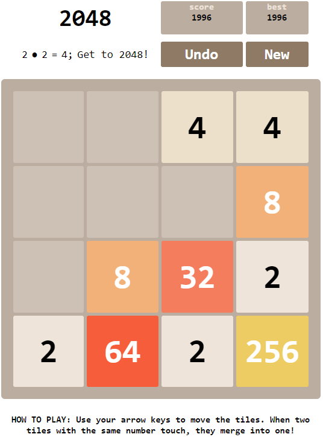
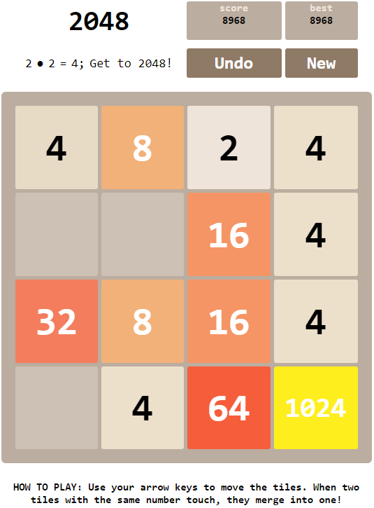
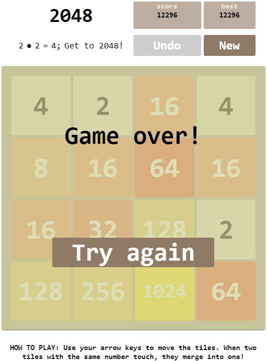

# Merge Ahead
Clone of merging blocks in a 4 by 4 grid

HTML div based approach featuring:
* Game state based music: New game, mid game, end of game
* Settings for width (qs param n=?), and which base number to start with (qs param e=?)
* High score
* Konami code causing gradient background

Start of game

Playing

1024!

Game Over

